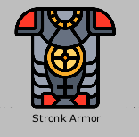
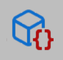
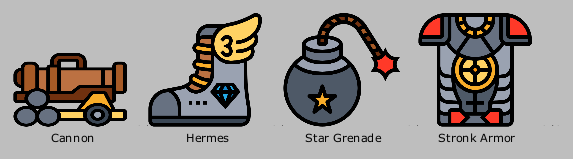
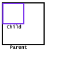
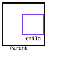
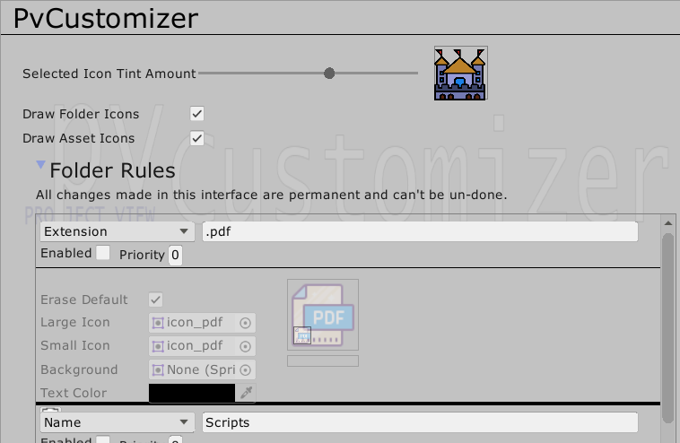

# PvCustomizer - What and Why

## What

This utility lets you customize the Project Window in two ways:

1. Draw custom icons for folders based on path/name/extension/regex matching.
2. Draw custom icons for Scriptable Object assets, adding flavor and ease-of-use to your project.

## Why

The creator of the repository holds the view that customization of the project browser/window in Unity is such a
fundamental QoL improvement that it shouldn't be locked behind assets that cost 15-20$ each. He does not claim that the
effort put behind such assets by their creators isn't reward-worthy. If you can afford these assets and think the
professional support to be a plus, I highly recommend purchasing them to support their ongoing development.

## Please Note

This utility is still in very early stages of development. The core is there, and it works -- on the surface. Please
report any bugs you find to harsh@aka.al or create a new issue.

# Table of Contents

- [Installation](#installation)
- [Quick Overview](#overview)
- [Folder Icons](#folder-icons)
- [Asset Icons](#asset-icons)
    - [Introduction](#asset-icons__introduction)
    - [Usage](#asset-icons__usage)
    - [Extending](#asset-icons__extending)
- [Settings](#settings)
- [Contact](#contact)

# Installation <a name="installation"/>

Use the Unity Package Manager to download from this git url. This lets you fetch updates more easily in the future.

# Overview <a name="overview"/>

There are two main parts of this utility: folder icons and asset icons.

### Asset Icons

The most usage out of **Asset Icons** you'll probably need is to put the `PvIconAttribute` on a serialized field of a
Scriptable Object. If the type of the field matches one of the drawers defined in the project, a custom icon will be
drawn inside the Project View.

Example:

```
public class InventoryItem : ScriptableObject 
{
    [PvIcon]
    public Sprite itemSprite;
}
```



### Folder Icons

Select a folder in the Unity Project Window and press `CTRL + ALT + C` to open the folder rule panel.

In this panel, you can configure the rule and the icon drawn for folders that match that rule. You can view all
currently registered rules in the Preferences/PvCustomizer settings menu.


You can disable rules, change type of rule, duplicate rules, modify priority (in case multiple rules match the folder).
Don't forget to apply the changes!

# Folder Icons <a name="folder-icons"/>


## Options

- The text field at the top is the **rule string**. The enum next to is the **rule type**. These are used to match a
  folder asset to a rule.

| RuleType | Description |
|:--------:|-------------|
| Name | This rule type matches the folder name directly. So, all folders in your assets with this name will match the rule.|
| Path | This is the strictest rule type. It matches only complete path of the folder from root of project. |
| Extension | This rule matches assets by their extension. E.g, ".pdf", ".txt", etc.
| Regex | This rule tries to do a C# regex match with the folder path. E.g. `.*Editor.*` matches the Editor folders and all of their descendant folders. Paths start from the project root, e.g. `Assets/Path/To/Asset`.

- **Enabled**: This toggle can enable or disable the usage of a rule, so you can temporarily disable rules.
- **Priority** : When multiple rules match a folder, the rule with the highest priority is used to draw the icon.
- **Erase Default**: Whether the icon will erase the default Unity icon. This is useful in case you want to add a small
  graphic to the folder instead of drawing a completely new one.
- **Large Icon**: When zoom is low in the second pane of the Project Window, this sprite will be used to draw the icon.
- **Small Icon**: When zoom is high in the second pane or we're drawing the folder tree in the first pane, this sprite
  will be used for the icon.
- **Background**: This sprite will be drawn *behind* the folder label.
- **Text Color**: This color will be used to draw the folder label text.

## Buttons

- **TrashCan/Delete**: Deletes the rule from the project. No take-backs.
- **Settings**: Shortcut for opening the asset settings.
- **Left Arrow**: Activates when multiple rules are being viewed. Goes to previous rule.
- **Right Arrow**: Activates when multiple rules are being viewed. Goes to next rule.
- **Plus/Duplicate**: Duplicates the currently selected rule. It won't be saved unless *Apply* is pressed.


- **Apply**: Applies any changes and saves any new rules. Only works on the currently selected rule, in case of multiple
  rules being viewed.
- **Cancel**: Closes the panel without saving any changes.
- **Reset Changes**: Restores the currently selected rule to the last saved state, abandoning all changes made since
  opening this panel.

# Asset Icons<a name="asset-icons"/>

## Introduction<a name="asset-icons__introduction"/>

When you create a class deriving from `ScriptableObject` and added a corresponding asset to the project, Unity likes to
show the following icon:



Now, Scriptable Objects are used *a lot* in Unity, from settings to databases. They're the best in-engine method of
modeling and storing data. Suffice it to say, they're used all over the engine.

Navigating the project view and looking for a particular asset, say "Toon Armor" of type `ArmorEquipment` requires you
to either type the name in the search bar or read labels. Contrast it with this:



## Usage<a name="asset-icons__usage"/>

### Basic Usage

All you need to get started is to put the `PvIconAttribute` `[PvIcon]` on a member of a class deriving from Scriptable
Object. The restrictions on valid members are:

- Field: May have any level of access modifier. Type of field must be a drawable type.
- Property: Must have a getter. Type of property must be a drawable type.
- Method: Must be a parameter-less method with return type non-void and one of the drawable types.

You may put the attribute on multiple fields and it'll draw all of them.

Additionally, you may put the attribute on the class itself, in which case it'll try to find a drawer for that type.
This is to easily let you draw highly customizable icons for your specific types.

The in-built drawers support the following types:

- Sprite
- Texture2D
- Audio
- Color
- Material
- Sprite Array
- Mesh

You can [add support](#asset-icons__extending) for your other types on your own, including custom types.

### Attribute Fields

The `PvIconAttribute` has a lot of fields to customize how the icon is drawn. Here's an explanation for them.

| Field | Description | Default  |Example |
|:-----:|:------------|:--------:|:------:|
| DontEraseDefault | If true, the drawer for this field won't erase the default asset icon. Good for small overlays that don't provide a main replacement icon. | `false` | `[PvIcon(dontEraseDefault: true)]`
| Width | Width of the icon in absolute or relative units. Append a `%` to the value to make it relative to the parent. | `"100%"` | `"20"` = 20 pixels <br/> `"40%"` = If total icon width is 60px, this icon's width will be 24px  |
| Height | Height of the icon in absolute or relative units. | `"100%"` | `"20"` = 20 pixels <br/> `"30%"` = If total icon height is 90px, this icon's height will be 27px.  |
| X | X-pos of [*anchored corner*](#anchoring) from *anchoring
corner* of the icon in absolute or relative units.  | `"0"` | `"20"` = 20 pixels from top-left for default anchoring  |
| Y | Y-pos of [*anchored corner*](#anchoring) from *anchoring
corner* of the icon in absolute or relative units. | `"0"` | `"20"` = 20 pixels from top-left for default anchoring |
| ScaleMode | One of `StretchToFill`, `ScaleAndCrop`, or `ScaleToFit` from the enum `PvScaleMode`. Describes how textures are scaled to fit the draw rectangle. | `PvScaleMode.ScaleToFit` | `PvScaleMode.StretchToFill` Stretches the texture to fill the complete rectangle passed in to GUI.DrawTexture. |
| Tint | A color to tint the drawn graphic with. Due to const-ness of attribute arguments, this is a hex color string. | `"#FFFFFF"` | `#FFFF00` for a yellow color. |
| MaxSize | Clamps the dimensions of the drawn graphic. For context, the icon size range is somewhere between 12-80. | `128` | `10` will limit the drawn icon to not exceed 10 pixels in size. |
| IconAnchor | One of nine anchors from the enum `PvAnchor`. This utility uses an [abnormal anchoring scheme](#anchoring) for ease-of-use. | `PvAnchor.MiddleCenter` | `PvAnchor.UpperLeft` will anchor the top-left corner of the drawn graphic to the top-left corner of the parent. |
| Display | String expression that can provide conditions under which to skip drawing of the icon. Currently only supports `"small" "large" ""` for drawing with certain icon size types.| `""` | `"small"` only draws the attribute when small icon is being rendered.<br />`"size > 32"` expressions will be supported in the future. |
| Layer | If multiple attributes are applied inside a class, they're drawn in the order of increasing layer value. | `0` | `1` will draw this graphic on top of all graphics with default layer value 0. |
| FontStyle | One of `Normal`, `Bold`, `Italic`, `BoldItalic` from `PvFontStyle` enum. Define the style for any text rendered during this icon's draw process. | `PvFontStyle.Normal` | `PvFontStyle.Bold` will draw bolded text. |
| Material | String name of another member with `Material` type to use for rendering this icon's graphics. Great for displaying Material/Texture combinations. The member referred can be (1) field, (2) property with getter, or (3) parameterless method with non-void return type. | `""` | `nameof(myMaterialField)` or "myMaterialField" |
| Grid | This is a quick grid layout built into the drawer. The format is `"rows:columns/position"`. Position count starts from `0` and is row-major. | `""` | `"3/3:1"` is the upper-middle square in a 3x3 grid. <br/> `"2/2:3"` is the bottom-right square in a 2x2 grid. |
| CustomData | An array of objects that can be used to pass custom data to your own drawers. | `null` in optional parameter<br/>`Array.Empty<object>()` stored in field. | `new object[]{5, 2, "Delta"}` anything you want. |
| TextAnchor | One of the `PvAnchor` enum values. This defines the anchor used for any of the text rendered during the icon graphic drawing. | `PvAnchor.MiddleCenter` | `PvAnchor.MiddleLeft` will left-and-middle align the text. |

## Anchoring <a name="anchoring"/>

Anchoring works a little unexpectedly in this utility to facilitate common uses for anchoring.

The anchor is one of 9 values, a combination of `Left` `Center` `Right` on horizontal and `Upper` `Middle` `Lower` on
the vertical.

The anchor chosen defines both the part of the graphic being drawn and the part of the parent it'll be anchored to.
Here's a couple of examples:

| Example | Anchor Type | Explanation |
|---------| ------------|-------------|
|| `PvAnchor.UpperLeft`|  Anchors the upper-left corner of the child to the upper-left corner of the parent.|
|| `PvAnchor.MiddleCenter`| Anchors the middle-center of the child to the middle-center of the parent.|
|| `PvAnchor.MiddleRight` | Anchors the middle-right of the child to the middle-right of the parent.|

This is a little unusual, but it lets the user do some common anchorings without having to do mental gymnastics with relative `X`/`Y` properties.

## Extending Asset Icons<a name="asset-icons__extending"/>

Check out the scripts in the DefaultDrawer folder.

**todo**

# Settings <a name="settings"/>

You may access the PvCustomizer settings under `Preferences/PvCustomizer`.



- **Tint Amount**: When an asset is selected, how much to tint the drawn graphic.
- **Draw Folder Icons**: Project-wide toggle for drawing folder icons at all.
- **Draw Asset Icons**: Project-wide toggle for drawing asset icons at all.
- **Folder Rules**: A list of all of the folder rules registered in this asset.

# Contact<a name="contact"/>

Add a new issue, or drop me an e-mail at [harsh@aka.al](mailto:harsh@aka.al "Mail to harsh@aka.al"). If the topic is
this repository, put `PvCustomizer` somewhere in the subject.

I also have a no-effort blog at [https://hdeep.tech](https://hdeep.tech).

Finally, you can find me under `karmicto` in
the [Game Dev League Discord](https://discord.gg/eJbG9VD8R9 "GDL Discord Invite Link").